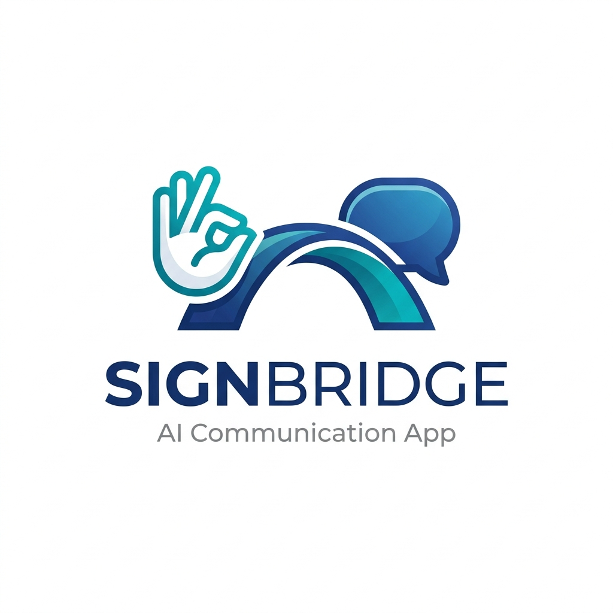
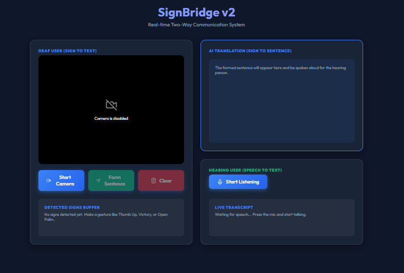
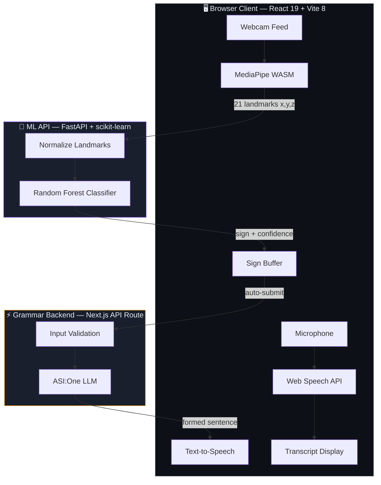
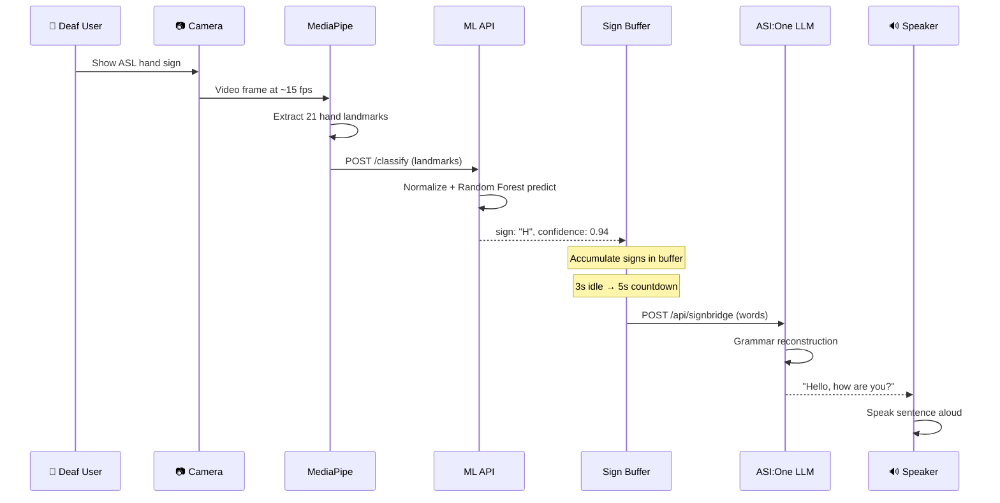
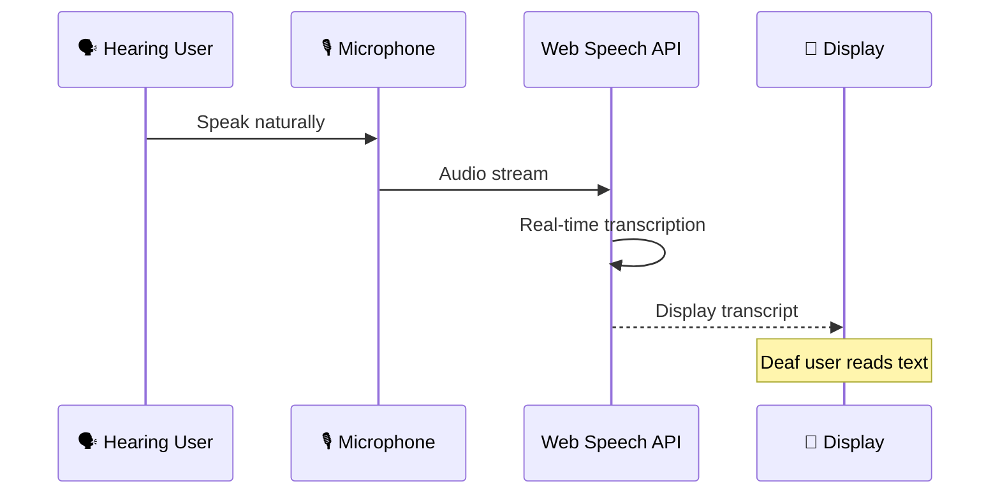
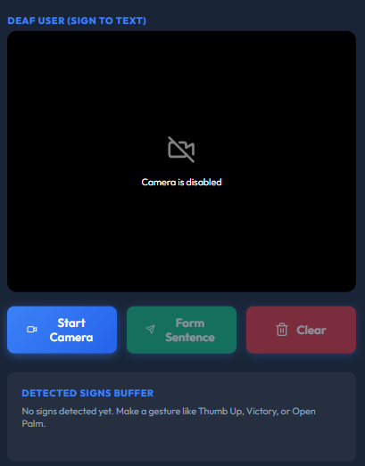
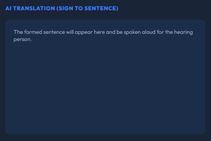
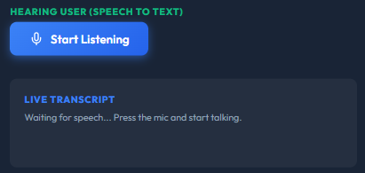
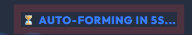

<div align="center">

  

  <h1>SignBridge V2</h1>

  <p><strong>AI-powered real-time two-way sign language communication bridge</strong></p>

  <p>
    Breaking the barrier between deaf and hearing communities through<br/>
    computer vision, machine learning, and natural language processing.
  </p>

  <br/>

  <a href="https://github.com/Pro1943/SignBridgeV2/blob/main/LICENSE"></a>
  
  <a href="https://github.com/Pro1943/SignBridgeV2/stargazers"></a>
  <a href="https://signbridgev2.vercel.app"></a>

  <br/><br/>

  <a href="https://signbridgev2.vercel.app">Live Demo</a>&nbsp;&nbsp;·&nbsp;&nbsp;<a href="#-features">Features</a>&nbsp;&nbsp;·&nbsp;&nbsp;<a href="#-quick-start">Quick Start</a>&nbsp;&nbsp;·&nbsp;&nbsp;<a href="#-system-architecture">Architecture</a>&nbsp;&nbsp;·&nbsp;&nbsp;<a href="https://github.com/Pro1943/Ml-API">ML API Repo</a>

</div>

<br/>

<div align="center">
  
  <br/>
  <sub><em>SignBridge V2 — Two-way communication interface in action</em></sub>
</div>

<br/>

---

## 📋 Table of Contents

- [About](#-about)
- [Features](#-features)
- [Two-Way Communication](#-two-way-communication)
- [System Architecture](#-system-architecture)
- [Built With](#-built-with)
- [How It Works](#-how-it-works)
- [ML Training Pipeline](#-ml-training-pipeline)
- [Quick Start](#-quick-start)
- [Project Structure](#-project-structure)
- [API Reference](#-api-reference)
- [Model Performance](#-model-performance)
- [In Action](#-in-action)
- [GitHub Stats](#-github-stats)
- [Roadmap](#-roadmap)
- [Contributing](#-contributing)
- [License](#-license)
- [Acknowledgments](#-acknowledgments)

---

## 💡 About

**SignBridge V2** is a full-stack, AI-powered communication system that enables real-time, two-way conversation between deaf and hearing individuals.

A deaf user signs ASL letters through their webcam. MediaPipe extracts 21 hand landmarks per frame, a Random Forest classifier identifies each letter, and an LLM reconstructs the detected sequence into a natural English sentence — spoken aloud via Text-to-Speech. In the reverse direction, a hearing user speaks into their microphone, and the browser's Speech-to-Text API transcribes the audio into on-screen text for the deaf user to read.

> **No plugins. No installs. No sign-up.** Everything runs in the browser with serverless API backends.

---

## ✨ Features

| Feature | Description |
|:--------|:------------|
| 🤟 **Real-Time Sign Detection** | MediaPipe WASM hand-tracking at ~15 fps with ML-powered ASL classification |
| 🧠 **AI Grammar Reconstruction** | ASI:One LLM transforms raw sign sequences into natural sentences |
| 🔊 **Text-to-Speech Output** | Premium voice synthesis with automatic spoken output for hearing users |
| 🎙️ **Speech-to-Text Input** | Browser-native speech recognition for hearing-to-deaf communication |
| ⏱️ **Smart Auto-Submit** | 3-second idle detection + 5-second countdown for hands-free operation |
| 🛡️ **Input Sanitization** | Client-side sign sanitization and server-side validation against prompt injection |
| ♿ **Accessibility-First** | WCAG 2.1 skip-nav, ARIA live regions, semantic HTML, descriptive alt text |
| 🌙 **Dark Editorial UI** | Medical-grade dark interface with Space Grotesk + DM Mono typography |
| 🔒 **Content Security Policy** | CSP headers, preconnect hints, and non-blocking font loading |
| ⚡ **Serverless Architecture** | Zero-infra deployment across Vercel with cold-start-optimized APIs |

---

## 🔄 Two-Way Communication

<div align="center">

| Direction | **Deaf → Hearing** | **Hearing → Deaf** |
|:---------:|:------------------:|:------------------:|
| **Input** | ASL hand signs via webcam | Voice via microphone |
| **Processing** | MediaPipe → ML API → LLM | Web Speech API (STT) |
| **Output** | Spoken sentence (TTS) 🔊 | Text transcript on screen 📝 |
| **Latency** | ~2–4 seconds end-to-end | Real-time |

</div>

---

## 🏗️ System Architecture



<div align="center">

| Service | Deployment | Repository |
|:--------|:----------:|:----------:|
| **Frontend** (React + Vite) | [signbridgev2.vercel.app](https://signbridgev2.vercel.app) | This repo |
| **ML API** (FastAPI + scikit-learn) | Vercel Serverless | [Pro1943/Ml-API](https://github.com/Pro1943/Ml-API) |
| **Grammar Backend** (Next.js) | Vercel Serverless | Private |

</div>

---

## 🛠️ Built With

<div align="center">

### Frontend


### Machine Learning


### Backend & Infrastructure


</div>

---

## ⚡ How It Works

### Sign-to-Speech Pipeline



### Speech-to-Text Pipeline



---

## 🔬 ML Training Pipeline

```mermaid
flowchart LR
    A["📁 Kaggle ASL Dataset"] --> B["🖼️ Image Collection"]
    B --> C["✋ MediaPipe Landmark Extraction"]
    C --> D["📊 21x3 Coordinate Vectors"]
    D --> E["⚖️ Normalization and Centering"]
    E --> F["✂️ Train/Test Split — 80/20"]
    F --> G["🌲 Random Forest Training — 100 Trees"]
    G --> H["💾 sign_classifier.pkl — 11.3 MB"]
    H --> I["🚀 FastAPI Inference Server"]
```



> **ML API Repository:** The complete training pipeline, model artifacts, and inference server are maintained at **[Pro1943/Ml-API](https://github.com/Pro1943/Ml-API)**.

---

## 🚀 Quick Start

### Prerequisites

| Tool | Version | Purpose |
|:-----|:--------|:--------|
| **Node.js** | ≥ 18.x | Frontend dev server |
| **npm** | ≥ 9.x | Package management |
| **Git** | Latest | Version control |
| **Modern Browser** | Chrome / Edge | WebRTC + Speech APIs |

### 1. Clone & Install

```bash
# Clone the repository
git clone https://github.com/Pro1943/SignBridgeV2.git
cd SignBridgeV2/frontend

# Install dependencies
npm install
```

### 2. Configure Environment

```bash
# Create .env file in frontend/
cp .env.example .env
```

```env
# frontend/.env
VITE_BACKEND_URL=https://backend-snowy-sigma-85.vercel.app/api/signbridge
VITE_ML_API_URL=http://localhost:8000/classify
```

### 3. Run Development Server

```bash
npm run dev
```

The app will be available at `http://localhost:5173`.

### 4. (Optional) Run ML API Locally

```bash
# In a separate terminal
git clone https://github.com/Pro1943/Ml-API.git
cd Ml-API
pip install -r requirements.txt
uvicorn main:app --reload --port 8000
```

> **Note:** The live demo at [signbridgev2.vercel.app](https://signbridgev2.vercel.app) is fully deployed — local setup is only needed for development.

---

## 📁 Project Structure

```
SignBridgeV2/
├── assets/                          # Static assets
│   ├── logo.png                     # Project logo
│   ├── hand_landmarker.task         # MediaPipe model binary (7.8 MB)
│   ├── screenshot_full_ui.png       # Full interface preview
│   ├── screenshot_sign_detection.png
│   ├── screenshot_ai_output.png
│   ├── screenshot_speech_to_text.png
│   └── screenshot_auto_submit.png
│
├── frontend/                        # React + Vite frontend
│   ├── src/
│   │   ├── components/
│   │   │   ├── WebcamSignDetector.jsx   # Camera + MediaPipe + ML integration
│   │   │   └── SpeechRecognition.jsx    # Browser STT component
│   │   ├── App.jsx                  # Root component + TTS + AI orchestration
│   │   ├── index.css                # Full design system (13 KB)
│   │   └── main.jsx                 # React DOM entry point
│   ├── public/                      # Static public assets
│   ├── index.html                   # HTML shell with CSP + font preloading
│   ├── package.json
│   ├── vite.config.js
│   └── .env                         # Environment variables (gitignored)
│
├── LICENSE                          # MIT License
├── README.md                        # You are here
└── report.md                        # Comprehensive codebase audit (58 findings)
```

> **Companion Repository:** The ML classification API lives at [**Pro1943/Ml-API**](https://github.com/Pro1943/Ml-API) — a standalone FastAPI service with training pipeline, model artifacts, and inference endpoints.

---

## 📡 API Reference

### ML Classification API

> **Base URL:** `https://github.com/Pro1943/Ml-API` · Deployed on Vercel Serverless

| Method | Endpoint | Body | Response | Description |
|:------:|:---------|:-----|:---------|:------------|
| `POST` | `/classify` | `{ "landmarks": [{"x","y","z"}...] }` | `{ "sign": "A", "confidence": 0.94 }` | Classify 21 hand landmarks into ASL sign |
| `GET` | `/` | — | `{ "status": "ok" }` | Health check |

<details>
<summary><strong>Example Request</strong></summary>

```json
{
  "landmarks": [
    { "x": 0.52, "y": 0.71, "z": -0.03 },
    { "x": 0.49, "y": 0.65, "z": -0.01 },
    "... (21 landmarks total)"
  ]
}
```

</details>

### Grammar Backend API

> **Base URL:** Vercel Serverless · Private deployment

| Method | Endpoint | Body | Response | Description |
|:------:|:---------|:-----|:---------|:------------|
| `POST` | `/api/signbridge` | `{ "words": ["H","E","L","L","O"] }` | `{ "sentence": "Hello!" }` | Reconstruct sign sequence into natural sentence via ASI:One LLM |
| `OPTIONS` | `/api/signbridge` | — | CORS preflight | CORS preflight handler |

---

## 📊 Model Performance

The Random Forest classifier (100 estimators) achieves the following metrics on the test set:

<div align="center">

| Metric | Score |
|:-------|:-----:|
| **Overall Accuracy** | 93% |
| **Macro Avg Precision** | 0.91 |
| **Macro Avg Recall** | 0.89 |
| **Macro Avg F1-Score** | 0.89 |
| **Classes Supported** | A–Z (excluding J, Z) + 0–9 |
| **Model Size** | 11.3 MB |
| **Inference Latency** | < 50ms |

</div>

> **Known Limitations:**
> - Letters **J** and **Z** require motion trajectories — single-frame classification cannot capture dynamic signs.
> - Letter **T** has insufficient training samples and may show reduced accuracy.
> - Model trained on a single dataset (Kaggle ASL) — accuracy may vary with different skin tones, lighting, and hand orientations.

---

## 📸 In Action

<div align="center">

<table>
  <tr>
    <td align="center">
      
      <br/><sub><strong>Sign Detection Panel</strong></sub>
    </td>
    <td align="center">
      
      <br/><sub><strong>AI Translation Output</strong></sub>
    </td>
  </tr>
  <tr>
    <td align="center">
      
      <br/><sub><strong>Speech-to-Text Input</strong></sub>
    </td>
    <td align="center">
      
      <br/><sub><strong>Auto-Submit Countdown</strong></sub>
    </td>
  </tr>
</table>

</div>

---

## 📈 GitHub Stats

<div align="center">

  
  &nbsp;&nbsp;
  

</div>

<div align="center">

  

</div>

---

## 🗺️ Roadmap

- [x] Real-time ASL alphabet detection (A–Z static signs)
- [x] AI-powered grammar reconstruction via LLM
- [x] Two-way communication (Sign ↔ Speech)
- [x] Auto-submit with idle detection + countdown
- [x] Dark editorial UI with Space Grotesk typography
- [x] Content Security Policy + font preloading
- [x] WCAG 2.1 Level A accessibility baseline
- [ ] Hand skeleton overlay on webcam feed
- [ ] Dynamic sign detection (J, Z) via temporal models
- [ ] Multi-hand tracking support
- [ ] Conversation history persistence (localStorage)
- [ ] Light mode toggle
- [ ] PWA with offline support
- [ ] Model retraining pipeline automation
- [ ] Cross-validation + hyperparameter tuning
- [ ] Support for additional sign languages (BSL, ISL)

---

## 🤝 Contributing

Contributions are welcome! This is a solo project, but community input is valued.

1. **Fork** the repository
2. **Create** a feature branch (`git checkout -b feature/amazing-feature`)
3. **Commit** your changes (`git commit -m 'Add amazing feature'`)
4. **Push** to the branch (`git push origin feature/amazing-feature`)
5. **Open** a Pull Request


---

## 📄 License

Distributed under the **MIT License**. See [`LICENSE`](./LICENSE) for details.

---

## 🏆 Built for the ASI:One AI Hackathon

<div align="center">

  <br/>

  

  <br/><br/>

  <p>
    <strong>SignBridge V2</strong> was proudly built for the <strong>ASI:One AI Hackathon</strong> —<br/>
    pushing the boundaries of AI-powered accessibility and inclusive communication.
  </p>

  <p>
    The mission: prove that a single developer, armed with modern AI tools,<br/>
    can build a production-grade accessibility platform in hackathon time.
  </p>

  <br/>

</div>

---

## 🙏 Acknowledgments

- [**MediaPipe**](https://developers.google.com/mediapipe) — Google's on-device ML framework for hand landmark detection
- [**ASI:One**](https://asi1.ai) — LLM API powering grammar reconstruction
- [**Kaggle ASL Dataset**](https://www.kaggle.com/datasets/ayuraj/asl-dataset) — Training data for the sign classifier
- [**Vercel**](https://vercel.com) — Serverless deployment platform
- [**Shields.io**](https://shields.io) — Dynamic badge generation
- [**GitHub Readme Stats**](https://github.com/anuraghazra/github-readme-stats) — Dynamic stats cards

---

<div align="center">

  

  <br/>

  <sub>Made with ❤️ by <a href="https://github.com/Pro1943">Abir Saha</a></sub>

  <br/><br/>

  <a href="https://signbridgev2.vercel.app"></a>

</div>
